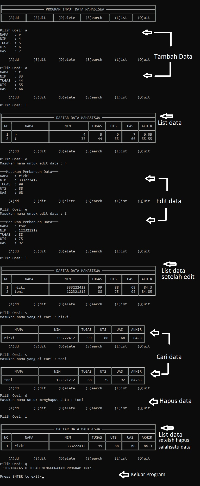

1.main.py berisi program utama untuk memanggil semua module yang ada 

2.daftar_nilai.py berisi modul untuk 
* tambah_data  
* ubah data  
* hapus data  
* cari data 

3 view_nilai.py berisi modul untuk 
* cetak daftar nilai 
* cetak hasil pencarian

4 input_nilai.py berisi modul untuk meminta user menginputkan data 

